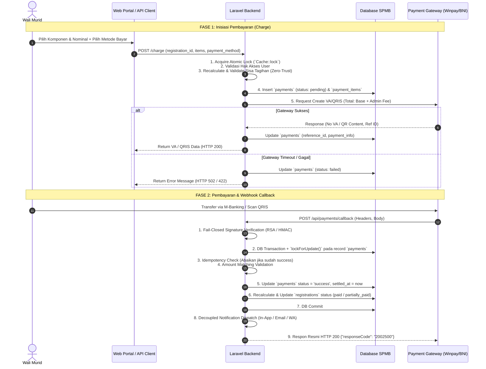

# Blueprint & Roadmap: Audit Arsitektur Sistem Pembayaran SPMB (Opsi C - Item-by-Item Ledger)

Dokumen ini berisi seluruh ringkasan arsitektur, temuan audit, aturan bisnis, skema database, dan panduan implementasi bertahap untuk sistem pembayaran SPMB Sekolah Anak Saleh.

---

## 📌 1. Latar Belakang & Masalah yang Diperbaiki

Berdasarkan hasil audit menyeluruh terhadap `PaymentController.php`, `WebDashboardController.php`, model `Registration.php`, dan alur integrasi gateway SNAP BI / Winpay / BNI:

1. **Bug Pilihan Registrasi di API `charge()`:**
   - Sebelumnya: `Registration::where('user_id', $user->id)->first();`
   - Masalah: Pengguna yang mendaftarkan lebih dari 1 anak selalu memproses pendaftaran anak pertama.
   - Solusi: Mewajibkan parameter `registration_id` eksplisit dengan validasi kepemilikan user.
2. **Risiko Transaksi Yatim (*Orphan Transaction*):**
   - Sebelumnya: Server menembak payment gateway terlebih dahulu sebelum mencatat record transaksi di database lokal.
   - Masalah: Jika pencatatan lokal gagal setelah gateway sukses, tagihan menggantung dan webhook gagal memproses.
   - Solusi: Simpan record `payments` berstatus `pending` di DB lokal terlebih dahulu $\rightarrow$ Panggil gateway $\rightarrow$ Update record lokal dengan nomor VA / QRIS.
3. **Pencampuran Biaya Admin Gateway ke Pokok Biaya Sekolah:**
   - Sebelumnya: `total_paid_final_fee` menjumlahkan kolom `amount` (yang berisi `base_amount + admin_fee`).
   - Masalah: Biaya admin transaksi (misal Rp4.500) keliru terhitung sebagai pelunasan uang gedung/SPP pendaftar.
   - Solusi: Seluruh kalkulasi pelunasan biaya sekolah murni menggunakan `base_amount` atau `payment_items.amount`.
4. **Pencatatan Cicilan Berbasis String Nama:**
   - Sebelumnya: Item tersimpan di JSON `payment_info['selected_items']` dan dicocokkan dengan string nama.
   - Solusi: Buat tabel relasional resmi `payment_items` dengan `spmb_fee_id` dan nominal pokok per item.
5. **Mutasi Data di Endpoint GET `form()`:**
   - Masalah: Method `WebDashboardController::form($id)` menjalankan query `update()` dan `delete()` pada `spmb_form_fields` setiap kali halaman dibuka.
   - Solusi: Bersihkan seluruh query mutasi dari controller GET.
6. **Silent Fallback Biaya Pendaftaran:**
   - Masalah: `getRegistrationFee()` fallback diam-diam ke default Rp350.000 jika tarif belum diset.
   - Solusi: Berikan error/exception yang eksplisit jika tarif unit belum dikonfigurasi.

---

## 🎯 2. Aturan Bisnis yang Ditetapkan: **Opsi C (Pilih Sendiri per Komponen)**

* **Mekanisme Wali Murid:**
  - Wali murid dapat mencentang komponen mana saja yang ingin dibayar (misal: *Uang Pangkal* Rp7.000.000 dan *Kegiatan* Rp1.000.000, *Seragam* nanti).
* **Prinsip *Zero-Trust Frontend*:**
  - Frontend hanya mengirim *intent*:
    ```json
    {
      "registration_id": 92,
      "payment_method": "MANDIRI",
      "items": [
        { "fee_id": 101, "amount": 7000000 },
        { "fee_id": 103, "amount": 1000000 }
      ]
    }
    ```
  - **Backend Recalculation:** Backend mengambil tarif resmi dari snapshot/database, menghitung sisa tagihan per item, memvalidasi bahwa nominal tidak melebihi sisa, menghitung total pokok (`base_amount`), menghitung `admin_fee`, dan menentukan total tagihan ke gateway (`amount = base_amount + admin_fee`).

---

## 🗄️ 3. Skema Database

```text
┌──────────────────────────────────────────────────────────┐
│                   TABLE: payments                        │
│ (Header Transaksi Pembayaran / Invoice)                  │
├──────────────────────────────────────────────────────────┤
│ • id (PK, BigInt)                                        │
│ • registration_id (FK -> registrations.id)               │
│ • invoice_number (Unique String: INV-SPMB-YYYYMMDD-...)  │
│ • amount (Decimal: base_amount + admin_fee)              │
│ • base_amount (Decimal: Total pokok biaya sekolah)       │
│ • admin_fee (Decimal: Biaya transaksi gateway)           │
│ • payment_method (String: MANDIRI, BCA, QRIS, dll)       │
│ • payment_gateway_code (String: winpay / bni)            │
│ • payment_type (registration_fee / final_fee)            │
│ • status (pending / success / failed / expired)          │
│ • reference_id (ID transaksi dari gateway)               │
│ • payment_info (JSON data dari gateway)                  │
│ • created_at / updated_at                                │
└────────────────────────────┬─────────────────────────────┘
                             │ 1 (One)
                             │
                             │ N (Many)
┌────────────────────────────▼─────────────────────────────┐
│                TABLE: payment_items                      │
│ (Detail Alokasi Tiap Komponen Tagihan)                   │
├──────────────────────────────────────────────────────────┤
│ • id (PK, BigInt)                                        │
│ • payment_id (FK -> payments.id, onDelete cascade)       │
│ • spmb_fee_id (FK -> spmb_fees.id, nullable)             │
│ • fee_name (String: "Uang Pangkal", "Seragam", dll)      │
│ • amount (Decimal: Nominal pokok alokasi item ini)       │
│ • created_at / updated_at                                │
└──────────────────────────────────────────────────────────┘
```

---

## 🔄 4. Alur Transaksi End-to-End



---

## 📋 5. Roadmap Tahapan Eksekusi

### 🔹 Tahap 1: Fondasi Database & Model
1. Buat migration `create_payment_items_table`.
2. Buat Eloquent Model `App\Models\PaymentItem` dengan relasi `belongsTo(Payment::class)` dan `belongsTo(SpmbFee::class)`.
3. Tambahkan relasi `hasMany(PaymentItem::class, 'payment_id')` di `App\Models\Payment`.

### 🔹 Tahap 2: Refactoring Logika Keuangan (`Registration.php`)
1. Perbaiki `getItemPaidAmount($feeName, $feeId)` agar membaca dari `payment_items` jika ada, dengan fallback data legacy `payment_info`.
2. Pastikan `total_paid_final_fee` murni menghitung pokok (`base_amount` atau `payment_items.amount`).
3. Pastikan `getRegistrationFee()` memberikan exception / error jelas jika konfigurasi tarif unit kosong.

### 🔹 Tahap 3: Refactoring Controller (`PaymentController.php` & `WebDashboardController.php`)
1. Wajibkan `registration_id` eksplisit di `charge()`.
2. Terapkan pola anti-orphan (insert record `pending` lokal $\rightarrow$ call gateway $\rightarrow$ update data respon / set `failed`).
3. Validasi ketat payment channel aktif.
4. Bersihkan query manipulasi database dari method GET `WebDashboardController::form()`.
5. Rapikan logging webhook callback agar aman untuk production.

### 🔹 Tahap 4: Pengujian Komprehensif (Testing & Validasi)
1. Uji pembayaran formulir pendaftaran.
2. Uji pelunasan penuh DSP.
3. Uji cicilan DSP Opsi C (pilih item & custom nominal).
4. Uji pencegahan webhook duplikat (*idempotency*).
5. Uji kegagalan tanda tangan dan nominal tidak cocok.

---

## 📊 6. Matriks Status Implementasi

| Modul / Komponen | Target Perubahan | Status |
| :--- | :--- | :--- |
| **Migration & Model** | Pembuatan tabel `payment_items` & model `PaymentItem` | ✅ **SELESAI** |
| **Model Registration** | Pemurnian `total_paid_final_fee` & `getItemPaidAmount` berbasis `payment_items` | ✅ **SELESAI** |
| **Pembersihan Controller** | Penghapusan mutasi skema ad-hoc dari method GET `form()` | ✅ **SELESAI** |
| **API Payment (`PaymentController`)** | Anti-orphan, recalculation Opsi C, pessimistic locking, idempotency callback | ✅ **SELESAI** |
| **Web Dashboard (`WebDashboardController`)** | Anti-orphan, penerbitan invoice & integrasi `payment_items` | ✅ **SELESAI** |
| **Multi-Gateway Webhook Routes** | Dedicated route per gateway (`/winpay`, `/bni`) & universal fallback | ✅ **SELESAI** |
| **Template UI & PDF** | Struk bayar, modal kwitansi, dan panel admin berbasis `items()` | ✅ **SELESAI** |
| **Automated & E2E Testing** | Test suite akuntansi ledger Opsi C & workflow webhook end-to-end | ✅ **SELESAI (100% LULUS)** |

